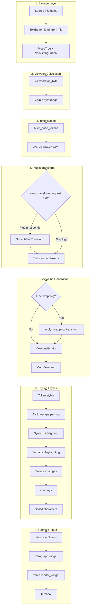
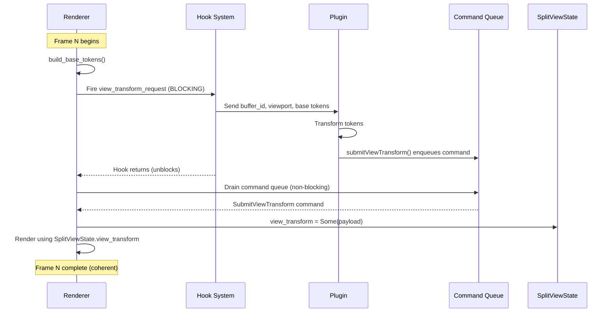
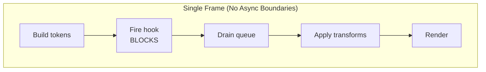
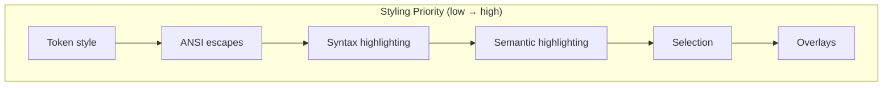
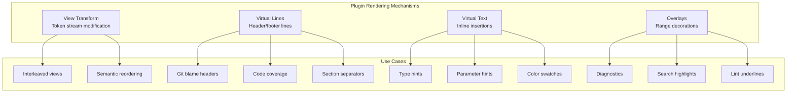
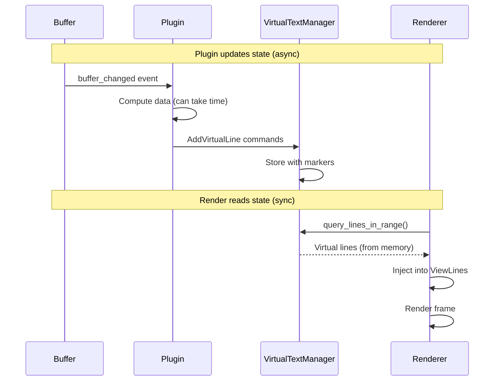
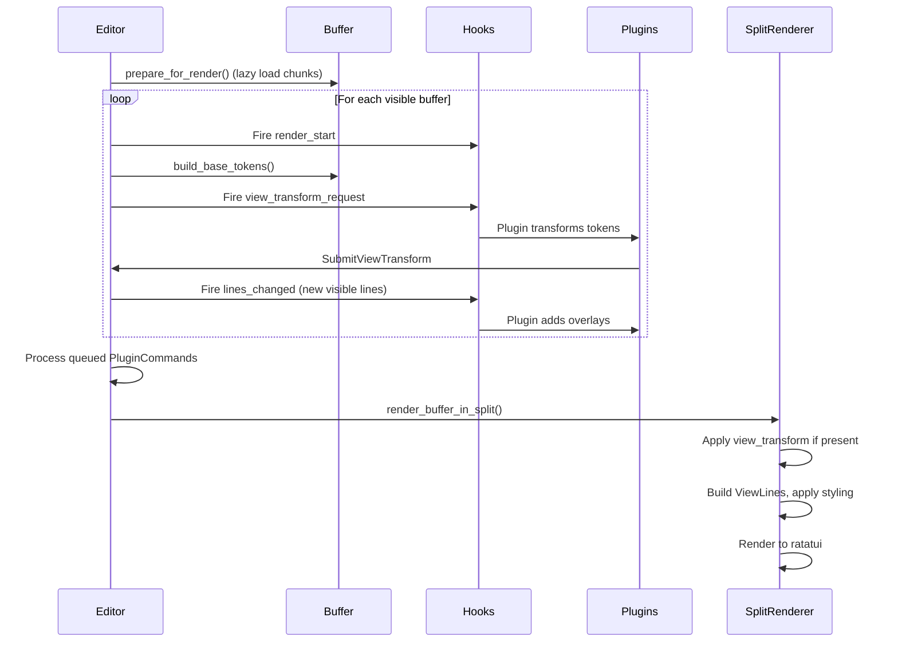

# Fresh Architecture

Fresh is a high-performance, terminal-based text editor built in Rust. It's designed to be fast, responsive, and extensible, with a modern architecture that draws inspiration from the best ideas in the world of text editors.

## Core Design Principles

*   **Performance First:** Every architectural decision is made with performance in mind. This includes the choice of data structures, the design of the rendering pipeline, and the implementation of core features.
*   **Event-Driven:** All state changes are represented as events, which are processed by a central event loop. This makes the editor's state predictable and enables features like unlimited undo/redo.
*   **Asynchronous I/O:** All file and process I/O is handled asynchronously on a separate thread pool. This ensures that the editor's UI is never blocked by slow I/O operations.
*   **Extensible:** A powerful TypeScript-based plugin system allows for deep customization and extension of the editor's functionality.

## High-Level Architecture

```
┌─────────────────────────────────────────────────────────┐
│                   MAIN THREAD (Sync)                    │
│  ┌──────────────┐  ┌──────────────┐  ┌─────────────┐    │
│  │ Event Loop   │→ │  Editor      │→ │  Renderer   │    │
│  │ (crossterm)  │  │  (state)     │  │  (ratatui)  │    │
│  └──────────────┘  └──────────────┘  └─────────────┘    │
│         ↓                 ↑                             │
│    Input Queue      EventQueue (mpsc)                   │
└─────────────────────────────────────────────────────────┘
         ↑                      ↑
         │ send events          │ send messages
         │                      │
    ┌────┴──────────┐  ┌────────┴──────────┐
    │ LSP Tasks     │  │ File I/O Tasks    │
    │ (Tokio)       │  │ (Tokio)           │
    └───────────────┘  └───────────────────┘
```

## The Document Model

To provide a clean separation between the editor's UI and the underlying text buffer, Fresh uses a `DocumentModel` trait. This abstraction layer is responsible for all interactions with the text buffer and provides a consistent API for both small and large files.

### Dual Position System

To support multi-gigabyte files where line indexing may be unavailable, the `DocumentModel` uses a dual position system:

*   **`DocumentPosition::LineColumn`:** For small files, this provides precise line and column-based positioning.
*   **`DocumentPosition::ByteOffset`:** For large files, this provides byte-offset-based positioning, which is always available and precise.

### The `DocumentModel` Trait

The `DocumentModel` trait defines a set of methods for interacting with the document, including:

*   **`get_viewport_content`:** The core rendering primitive, which returns the content for the visible portion of the screen.
*   **`position_to_offset` and `offset_to_position`:** For converting between the two position types.
*   **`insert`, `delete`, and `replace`:** For modifying the document's content.

This abstraction allows the rest of the editor to be blissfully unaware of the details of the underlying text buffer, such as whether it's a small file with a full line index or a large file with lazy loading.

## The Buffer

The core of the editor is the text buffer, which is implemented as a **`PieceTree`**. A `PieceTree` is a balanced binary tree that represents the text as a sequence of "pieces," which are references to either the original, immutable file buffer or an in-memory buffer of user additions.

This data structure provides several key advantages:

*   **O(log n) Edits:** Inserts and deletes are O(log n), where n is the number of pieces. This makes text editing extremely fast, even in large files.
*   **Efficient Memory Usage:** The `PieceTree` only stores the changes to the file, not the entire file content. This makes it very memory-efficient, especially for large files.
*   **Lazy Loading:** For multi-gigabyte files, Fresh uses a lazy loading strategy. The file is not loaded into memory all at once. Instead, chunks of the file are loaded on demand as the user scrolls through the file.

## The Rendering Pipeline

The rendering pipeline transforms source bytes into styled terminal output through a series of well-defined stages. Each stage preserves source-byte mappings for cursor positioning, and plugins can intercept the pipeline at multiple points.

### Complete Data Flow



### Stage 1: Source Storage

Source bytes are stored in a `PieceTree` (`src/piece_tree.rs`), a balanced tree of pieces referencing either the original file or an append-only buffer of edits.

| File Size | Storage Strategy | Line Indexing |
|-----------|-----------------|---------------|
| < 100MB | `BufferData::Loaded { data, line_starts }` | Full index available |
| ≥ 100MB | `BufferData::Unloaded { file_path, file_offset, bytes }` | Lazy chunk loading |

**Key files:** `src/text_buffer.rs:141-149`, `src/piece_tree.rs:12-36`

### Stage 2: Viewport Calculation

The `Viewport` (`src/viewport.rs`) determines which bytes are visible:

```rust
Viewport {
    top_byte: usize,      // Authoritative scroll position
    left_column: usize,   // Horizontal scroll
    width: u16,
    height: u16,
}
```

`top_byte` is the anchor—line boundaries are discovered by scanning backward. This works even for files without line indexing.

**Key file:** `src/viewport.rs:94-104`

### Stage 3: Tokenization

`build_base_tokens()` converts visible bytes into a stream of `ViewTokenWire`:

```rust
pub struct ViewTokenWire {
    pub source_offset: Option<usize>,  // Maps back to source byte
    pub kind: ViewTokenWireKind,       // Text | Newline | Space | Break
    pub style: Option<ViewTokenStyle>, // For injected content
}
```

The `source_offset` field is critical—it enables cursor positioning and determines whether syntax highlighting applies.

**Key file:** `src/ui/split_rendering.rs:581-654`

### Stage 4: Plugin View Transform

Plugins can intercept and transform the token stream before it becomes display lines.

#### Synchronization Model

The view transform system uses a **synchronous, single-threaded frame pipeline** to guarantee per-frame coherence:



| Phase | Operation | Sync/Async | Blocks Frame? |
|-------|-----------|-----------|---------------|
| Hook fire | `run_hook("view_transform_request")` | **Sync** | Yes |
| Plugin execution | Plugin transforms tokens | **Sync** | Yes (in-thread) |
| Command enqueue | `submitViewTransform()` | Sync | No (mpsc send) |
| Queue drain | `process_commands()` | Sync | No (try_recv) |
| State update | `view_state.view_transform = payload` | Sync | No |
| Render | Read `SplitViewState.view_transform` | Sync | No |

**Key files:**
- Hook firing: `src/editor/render.rs:135`
- Command queue: `src/ts_runtime.rs:2996-3002`
- Queue drain: `src/editor/render.rs:194-200`
- State update: `src/editor/mod.rs:4209-4226`

#### Frame Coherence Guarantees

The design ensures **frame coherence**—each frame renders with a consistent view of all state:

1. **Hooks block the frame** - `run_hook()` does not return until all plugin callbacks complete
2. **Commands drain immediately** - After hooks return, pending commands are processed before rendering
3. **Single source of truth** - `SplitViewState.view_transform` is updated in-place, then read during render
4. **No async gaps** - No `await` points between state mutation and rendering



#### Stale Transform Behavior

If a plugin does **not** respond (doesn't call `submitViewTransform`), the renderer uses whatever transform is already in `SplitViewState`:

| Scenario | Behavior |
|----------|----------|
| Plugin responds this frame | New transform used immediately |
| Plugin doesn't respond | Previous frame's transform reused |
| Plugin calls `ClearViewTransform` | Falls back to base tokens |
| No plugin registered | Base tokens used (no transform) |

#### Performance Implications

Because hooks are **blocking**, slow plugins stall the entire frame:

```
Frame timeline (60 FPS target = 16.6ms budget):

Fast plugin:    [tokens 1ms][hook 2ms][drain <1ms][render 5ms] = 8ms ✓
Slow plugin:    [tokens 1ms][hook 50ms][drain <1ms][render 5ms] = 56ms ✗ (dropped frames)
```

**Best practices for plugins:**
- Pre-compute annotation positions during async operations (file load, git commands)
- Store computed data in plugin state
- In `view_transform_request`, only do O(viewport) token manipulation
- Never perform I/O or spawn processes inside the hook

**Hook:** `view_transform_request` (`src/editor/render.rs:113-135`)

**Plugin command:** `PluginCommand::SubmitViewTransform` (`src/plugin_api.rs:259-264`)

**Token semantics:**
- `source_offset: Some(n)` → Source content, syntax highlighting applied
- `source_offset: None` → Injected by plugin, uses `style` field instead

**Use cases:** Git blame annotations, markdown soft breaks, interleaved views, code coverage headers.

### Stage 5: ViewLine Generation

`ViewLineIterator` (`src/ui/view_pipeline.rs`) converts tokens into display lines:

```rust
pub struct ViewLine {
    pub text: String,                       // Tabs expanded to spaces
    pub char_mappings: Vec<Option<usize>>,  // Display char → source byte
    pub char_styles: Vec<Option<ViewTokenStyle>>,
    pub tab_starts: HashSet<usize>,
    pub line_start: LineStart,              // Source | Injected | Wrapped
}
```

**Tab expansion:** `'\t'` → `(8 - (col % 8))` spaces, each mapped to the original tab byte.

**Line classification:** `LineStart::AfterInjectedNewline` distinguishes plugin-injected lines (no line number shown) from source lines.

**Key file:** `src/ui/view_pipeline.rs:72-74`

### Stage 6: Styling Layers

Multiple styling systems are applied per character, in order:



| Layer | Source | Applies To |
|-------|--------|-----------|
| Token style | `ViewTokenWire.style` | Injected content (`source_offset: None`) |
| ANSI escapes | `AnsiParser::parse_char()` | Content with escape sequences |
| Syntax | Tree-sitter (`src/highlighter.rs`) | Source content only |
| Semantic | Word occurrence matching | Matching identifiers |
| Selection | Cursor ranges | Selected text |
| Overlays | `OverlayManager` | Diagnostics, search hits |

**Key file:** `src/ui/split_rendering.rs:1005-1720`

### Stage 7: Ratatui Output

Styled characters are accumulated into ratatui `Span`s, grouped into `Line`s:

```rust
// Final structure
Vec<Line> {
    Line {
        spans: Vec<Span> {
            Span { content: String, style: Style }
        }
    }
}

// Handoff to ratatui
frame.render_widget(Clear, render_area);
frame.render_widget(Paragraph::new(lines), render_area);
frame.set_cursor_position((cursor_x, cursor_y));
```

**Key file:** `src/ui/split_rendering.rs:1926-1930`

### Plugin Integration Points

Fresh provides four independent mechanisms for plugins to affect rendering:



#### Emacs-like Persistent State Model

Fresh follows an **Emacs-inspired architecture** for plugin rendering where:

1. **Plugins update state in response to events** (buffer changes, file open) - async, fire-and-forget
2. **State is stored persistently** with marker-based position tracking
3. **Render loop reads state synchronously** from memory - no async waiting

This ensures **frame coherence**: each frame renders with a consistent snapshot of all plugin state.



#### View Transform (`PluginCommand::SubmitViewTransform`)

Modifies the entire token stream. For advanced use cases requiring complete restructuring.

```rust
PluginCommand::SubmitViewTransform {
    buffer_id,
    split_id,
    payload: ViewTransformPayload {
        range: Range<usize>,
        tokens: Vec<ViewTokenWire>,
        layout_hints: Option<LayoutHints>,
    },
}
```

**Note:** View transforms use a per-frame hook which has sync/async timing considerations. For simpler annotation use cases, prefer Virtual Lines.

**Key file:** `src/plugin_api.rs:122-130`

#### Virtual Lines (`PluginCommand::AddVirtualLine`)

Injects full display lines above or below source lines. **Recommended for git blame, code coverage, section headers.**

```rust
PluginCommand::AddVirtualLine {
    buffer_id,
    position: usize,           // Anchor byte position
    text: String,              // Full line content
    color: (u8, u8, u8),       // RGB color
    above: bool,               // true = above, false = below
    namespace: String,         // For bulk removal
    priority: i32,             // Ordering at same position
}

// Clear all virtual lines in a namespace (before updating)
PluginCommand::ClearVirtualTextNamespace {
    buffer_id,
    namespace: String,
}
```

**Characteristics:**
- Lines do NOT show line numbers in the gutter
- Positions auto-adjust on buffer edits (marker-based)
- Namespaced for efficient bulk removal
- Read synchronously during render (no frame lag)

**Example: Git blame plugin**
```typescript
fresh.hooks.on('buffer_changed', async (bufferId) => {
  const blame = await computeGitBlame(bufferId);

  // Clear old headers
  fresh.clearVirtualTextNamespace(bufferId, 'git-blame');

  // Add new headers (persistent until next change)
  for (const chunk of blame.chunks) {
    fresh.addVirtualLine({
      bufferId,
      position: chunk.startByte,
      text: `── ${chunk.commit} (${chunk.author}) ──`,
      color: [128, 128, 128],
      above: true,
      namespace: 'git-blame',
      priority: 0,
    });
  }
});
```

**Key file:** `src/virtual_text.rs`

#### Virtual Text - Inline (`PluginCommand::AddVirtualText`)

Inserts styled text inline (before/after a character). For type hints, parameter hints.

```rust
PluginCommand::AddVirtualText {
    buffer_id,
    virtual_text_id: String,
    position: usize,
    text: String,
    color: (u8, u8, u8),
    before: bool,  // true = before char, false = after
}
```

**Key file:** `src/virtual_text.rs`

#### Overlays (`PluginCommand::AddOverlay`)

Applies decorations to byte ranges. Stored in `BTreeMap<usize, Vec<Overlay>>` for O(log n) lookup.

```rust
PluginCommand::AddOverlay {
    buffer_id,
    namespace: Option<OverlayNamespace>,
    range: Range<usize>,
    color: (u8, u8, u8),
    underline: bool,
    bold: bool,
    italic: bool,
} -> OverlayHandle
```

**Performance optimizations:**
1. **Line-indexed storage:** Overlays keyed by starting line for fast viewport filtering
2. **Render-time cache:** Visible overlays cached per frame
3. **Diagnostic hash check:** LSP diagnostics skip update if unchanged

**Key file:** `src/overlay.rs`

### Per-Split View State

Each split maintains independent view state, enabling different presentations of the same buffer:

```rust
pub struct SplitViewState {
    pub view_transform: Option<ViewTransformPayload>,
    pub compose_width: Option<u16>,
    pub compose_column_guides: Option<Vec<u16>>,
    pub layout: Option<Layout>,
    pub layout_dirty: bool,
}
```

**Example:** Split A shows normal view, Split B shows git blame—same buffer, different transforms.

**Key file:** `src/split.rs:60-105`

### Render Phase Hook Sequence



**Key file:** `src/editor/render.rs:97-201`

### Performance Characteristics

| Operation | Complexity | Notes |
|-----------|-----------|-------|
| File load (small) | O(n) | Full line indexing |
| File load (large) | O(1) | Lazy, viewport-only |
| Viewport scroll | O(log n) | Binary search for line boundary |
| Syntax highlighting | O(viewport) | Tree-sitter parses visible lines only |
| Overlay lookup | O(log n + k) | n = total overlays, k = visible |
| Render frame | O(height) | Independent of file size |

## LSP Integration

Fresh has a deep and robust integration with the Language Server Protocol (LSP), providing features like code completion, diagnostics, and go-to-definition.

The LSP integration is built on a multi-threaded architecture that ensures the editor's UI is never blocked by the language server.

*   **`LspManager`:** A central coordinator that manages multiple language servers (one for each language).
*   **`LspHandle`:** A handle to a specific language server, providing a non-blocking API for sending commands and notifications.
*   **`AsyncBridge`:** An `mpsc` channel that bridges the asynchronous world of the LSP tasks with the synchronous world of the editor's main event loop.

This architecture allows Fresh to communicate with language servers in a highly efficient and non-blocking way, providing a smooth and responsive user experience.

## Annotated Views

Fresh supports **Annotated Views**, a powerful pattern for displaying file content with injected annotations (such as headers, metadata lines, or visual separators) while preserving core editor features like line numbers and syntax highlighting. This architecture enables features like git blame, code coverage overlays, and inline documentation.

### The Problem

Consider displaying git blame information: you want to show the file content with header lines above each block indicating the commit, author, and date. A naive approach creates several problems:

1. **Line Number Mismatch:** If headers are part of the buffer content, line numbers include them, making it impossible to show "line 42" next to the actual line 42 of the source file.

2. **Syntax Highlighting Loss:** If the buffer contains mixed content (headers + code), tree-sitter cannot parse it correctly, and syntax highlighting breaks.

3. **Historical Content:** For features like "blame at parent commit," you need to display historical file versions that differ from the current file.

### The Solution: View Transforms + Virtual Buffers

Fresh solves this with a hybrid architecture combining two mechanisms:

```
┌─────────────────────────────────────────────────────────────────┐
│                    ANNOTATED VIEW ARCHITECTURE                  │
├─────────────────────────────────────────────────────────────────┤
│                                                                 │
│   ┌─────────────────────────────────────────────────────────┐  │
│   │              Virtual Buffer (Content Layer)              │  │
│   │  • Contains actual file content (current or historical) │  │
│   │  • Language detected from buffer name extension         │  │
│   │  • Syntax highlighting via tree-sitter                  │  │
│   │  • Text properties store annotation metadata            │  │
│   └─────────────────────────────────────────────────────────┘  │
│                              │                                  │
│                              ▼                                  │
│   ┌─────────────────────────────────────────────────────────┐  │
│   │             View Transform (Presentation Layer)          │  │
│   │  • Injects annotation headers between content blocks    │  │
│   │  • Headers: source_offset = None (no line number)       │  │
│   │  • Content: source_offset = Some(byte) (has line num)   │  │
│   │  • Styling via ViewTokenWire.style field                │  │
│   └─────────────────────────────────────────────────────────┘  │
│                              │                                  │
│                              ▼                                  │
│   ┌─────────────────────────────────────────────────────────┐  │
│   │                   Rendered Output                        │  │
│   │     ── abc123 (Alice, 2 days ago) "Fix bug" ──          │  │
│   │  42 │ fn main() {                                       │  │
│   │  43 │     println!("Hello");                            │  │
│   │     ── def456 (Bob, 1 week ago) "Add feature" ──        │  │
│   │  44 │     do_something();                               │  │
│   │  45 │ }                                                 │  │
│   └─────────────────────────────────────────────────────────┘  │
│                                                                 │
└─────────────────────────────────────────────────────────────────┘
```

### Key Components

#### 1. Virtual Buffer with Content

The first layer is a virtual buffer containing the actual file content. Key properties:
- Buffer name includes file extension (e.g., `*blame:main.rs*`) for automatic language detection
- Content is pure source code, enabling correct tree-sitter parsing
- Text properties can store metadata without affecting content

#### 2. ViewTokenWire with Source Mapping

The `ViewTokenWire` structure (in `src/plugin_api.rs`) enables precise control over line numbering via its `source_offset` field:

- **`Some(byte_position)`:** Token maps to source content. The renderer includes it in line number calculation, applies syntax highlighting, and enables cursor positioning.
- **`None`:** Token is injected annotation. The renderer skips line number increment (shows blank in gutter), applies the `style` field if present, and does not participate in source-based features.

#### 3. View Transform Hook

Plugins register for the `view_transform_request` hook, called each render frame. The plugin receives the current viewport's tokens and can inject headers with `source_offset: None`, passing through content tokens unchanged to preserve line numbers and highlighting.

### How Line Numbers Work

The renderer in `split_rendering.rs` checks if the previous character had no source mapping. Lines starting after a `source_offset: None` newline show blank in the line number gutter. Lines starting after a `source_offset: Some(_)` newline increment and display the line number.

### How Syntax Highlighting Works

Syntax highlighting is applied based on `source_offset`. Content tokens with `Some(byte)` are looked up in highlight spans and colored. Annotation tokens with `None` skip highlight lookup and use the `style` field instead.

### Use Cases

**Git Blame:** Virtual buffer contains historical file content from `git show commit:path`. Annotations are commit headers above each blame block. Line numbers match historical file lines.

**Code Coverage:** Buffer contains current file content. Annotations are coverage percentage headers above functions. Line numbers match current file.

**Inline Documentation:** Buffer contains source code. Annotations are doc comments rendered as styled blocks. Line numbers only appear for code lines.

### Performance Considerations

1. **Viewport-Only Processing:** View transforms only process the visible viewport, not the entire file. For a 100K line file, only ~50 lines are transformed per frame.

2. **Efficient Block Lookup:** Annotation metadata should be stored in a sorted structure enabling O(log n) lookup of blocks overlapping the viewport.

3. **Frame-Rate Transform:** The `view_transform_request` hook is called every frame. Plugins must respond quickly. Pre-compute annotation positions; don't run git commands during the hook.

4. **Caching:** View transforms are cached per-split and reused until explicitly cleared or the viewport changes significantly.

### Implementation Checklist

To implement an annotated view feature:

1. **Define annotation structure:** What metadata accompanies each block? (commit info, coverage data, etc.)

2. **Create content buffer:** Use `createVirtualBuffer` with appropriate name for language detection

3. **Store block positions:** Track byte ranges for each annotation block in the content

4. **Implement view transform hook:** Inject headers with `source_offset: None` and `style`, pass through content tokens unchanged

5. **Handle navigation:** Map cursor positions in the view back to logical positions in your annotation model

6. **Support refresh:** When annotations change (e.g., blame at different commit), update buffer content and block positions; view transform auto-updates on next render

## Buffer vs View: State Separation

Fresh cleanly separates **Buffer state** (the document) from **View state** (how it's displayed). This enables multiple independent views of the same buffer, each with its own scroll position, cursor, and view transform.

### Why Separate?

Consider two splits showing the same file:
- Split A: Normal view, scrolled to line 100, cursor at line 105
- Split B: Git blame view, scrolled to line 1, cursor at line 10

Both views share the same underlying text, but have completely independent:
- Scroll positions (viewport)
- Cursor positions
- View transforms (blame vs normal)
- Computed layouts

### The State Model

```
┌─────────────────────────────────────────────────────────────┐
│                    BUFFER STATE (shared)                    │
│  EditorState per buffer_id                                  │
│  ┌────────────────────────────────────────────────────────┐ │
│  │ • buffer: PieceTree (actual text content)              │ │
│  │ • undo/redo history                                    │ │
│  │ • syntax highlighter (tokens derived from content)     │ │
│  │ • overlays (content-anchored decorations)              │ │
│  │ • markers (bookmarks, breakpoints)                     │ │
│  └────────────────────────────────────────────────────────┘ │
└─────────────────────────────────────────────────────────────┘
                              │
            ┌─────────────────┼─────────────────┐
            ▼                                   ▼
┌───────────────────────────┐     ┌───────────────────────────┐
│   VIEW STATE (Split A)    │     │   VIEW STATE (Split B)    │
│   SplitViewState          │     │   SplitViewState          │
│ ┌───────────────────────┐ │     │ ┌───────────────────────┐ │
│ │ • viewport (scroll)   │ │     │ │ • viewport (scroll)   │ │
│ │ • cursors             │ │     │ │ • cursors             │ │
│ │ • view_transform      │ │     │ │ • view_transform      │ │
│ │ • view_mode           │ │     │ │ • view_mode           │ │
│ │ • layout (computed)   │ │     │ │ • layout (computed)   │ │
│ └───────────────────────┘ │     │ └───────────────────────┘ │
└───────────────────────────┘     └───────────────────────────┘
```

### Event Routing

Events are routed based on whether they affect the buffer or the view:

**Buffer Events** → Applied to shared `EditorState`:
- `Insert`, `Delete` (text modifications)
- `AddOverlay`, `RemoveOverlay` (content decorations)
- Undo/Redo

**View Events** → Applied to `SplitViewState` for active split:
- `Scroll` (viewport movement)
- `MoveCursor` (cursor navigation)
- `SetViewMode` (normal/blame/etc)

When a buffer event modifies content, ALL views of that buffer must:
1. Adjust their cursor positions (if affected by the edit)
2. Mark their layout as dirty (needs rebuild)

### Syntax Highlighting: Buffer or View?

Base syntax highlighting is **buffer state** because:
- Tokens are derived from content (same content = same tokens)
- Expensive to compute, wasteful to duplicate per-view
- Most editors share highlighting across views

However, **style application** can be view-specific via view transforms. A git blame view transform can restyle tokens (dim old code, highlight recent changes) without affecting other views.

## The Layout Layer

The Layout is **View state**, not Buffer state. Each view (split) has its own Layout computed from its view_transform. This enables different views of the same buffer to have different layouts (e.g., blame view vs normal view).

### The Two Layers

```
┌─────────────────────────────────────────────────────────────┐
│              BUFFER LAYER (EditorState - shared)            │
│  • Buffer: source bytes (PieceTree)                         │
│  • Syntax tokens (shared across views)                      │
│  • Overlays, markers (content-anchored)                     │
└─────────────────────────────────────────────────────────────┘
                              │
          ┌───────────────────┼───────────────────┐
          ▼                                       ▼
┌─────────────────────────────┐     ┌─────────────────────────────┐
│  VIEW LAYER (Split A)       │     │  VIEW LAYER (Split B)       │
│  SplitViewState             │     │  SplitViewState             │
│ ┌─────────────────────────┐ │     │ ┌─────────────────────────┐ │
│ │ view_transform (plugin) │ │     │ │ view_transform (plugin) │ │
│ │         │               │ │     │ │         │               │ │
│ │         ▼               │ │     │ │         ▼               │ │
│ │ layout (ViewLines)      │ │     │ │ layout (ViewLines)      │ │
│ │         │               │ │     │ │         │               │ │
│ │         ▼               │ │     │ │         ▼               │ │
│ │ viewport (view line idx)│ │     │ │ viewport (view line idx)│ │
│ │ cursors (source bytes)  │ │     │ │ cursors (source bytes)  │ │
│ └─────────────────────────┘ │     │ └─────────────────────────┘ │
└─────────────────────────────┘     └─────────────────────────────┘
                │                                 │
                ▼                                 ▼
┌─────────────────────────────┐     ┌─────────────────────────────┐
│         RENDERING           │     │         RENDERING           │
│  ViewLines[top..top+height] │     │  ViewLines[top..top+height] │
└─────────────────────────────┘     └─────────────────────────────┘
```

### Why Two Layers?

When view transforms inject content (like git blame headers), the display has **more lines** than the source buffer:

```
Source Buffer (5 lines):     Display Layout (7 lines):
─────────────────────        ─────────────────────────
Line 1                       ── Header (injected) ──
Line 2                       Line 1
Line 3                       Line 2
Line 4                       ── Header (injected) ──
Line 5                       Line 3
                             Line 4
                             Line 5
```

If the viewport operates on source lines, scroll limits are wrong (can't scroll to show all 7 display lines). If cursor movement uses source lines, pressing ↓ skips over injected headers.

The solution: **viewport and visual navigation operate on the Layout Layer**.

### Key Data Structures

See source files for current implementations:

- **ViewLine** (`src/ui/view_pipeline.rs`): A single display line with `char_mappings` mapping each character to source byte (None = injected), plus styles and tab expansion info.

- **Layout** (`src/ui/view_pipeline.rs`): Collection of ViewLines for the viewport region, with `byte_to_line` index for fast source byte → view line lookup.

- **SplitViewState** (`src/split.rs`): Per-split state including cursors, viewport, view_transform, layout, and layout_dirty flag.

- **Viewport** (`src/viewport.rs`): Scroll position (currently `top_byte` in source bytes), dimensions, and scroll offset settings.

- **Cursor** (`src/cursor.rs`): Position in source bytes with optional selection anchor.

### Layout Building Strategy

Following VSCode's ViewModel pattern, the Layout is built **lazily but is never optional**. Every operation that needs Layout calls `ensure_layout()` first (see `src/split.rs`). There is no "fallback to buffer-based scrolling" - Layout always exists when needed.

**Layout becomes dirty when:**
- Buffer content changes (Insert/Delete events)
- View transform changes (plugin sends new tokens)
- Scroll would move past current layout's source_range

### Viewport Stability

When the layout changes (edit, view transform update), view line indices shift. To maintain stable scroll position:

1. **Store anchor_byte**: The source byte at the top of the viewport
2. **On layout rebuild**: Find anchor_byte in new layout → new top_view_line
3. **Clamp if needed**: If anchor_byte no longer exists, clamp to valid range

### Scrolling Beyond the Current Layout

The Layout is built from viewport-scoped tokens (for performance). When scrolling would move past the current layout:

1. **Request new tokens** from the view transform for the target range
2. **Rebuild layout** to cover the new viewport
3. **Complete the scroll** using the new layout

The estimate for the target byte doesn't need to be perfect - the view transform will give correct tokens for whatever range is requested.

### Tracking Total View Lines

To know scroll limits without building the entire layout, we track `total_view_lines` and `total_injected_lines` in the Layout struct. The plugin knows how many headers it injects and can report this in the view transform response via `total_injected_lines` in layout hints.

## Viewport Ownership and Scrolling

This section documents the authoritative architecture for viewport state and scrolling. The key principle: **SplitViewState.viewport is the single source of truth for scroll position**.

### The Problem with Duplicate State

Early implementations had viewport state in two places: `EditorState` (per buffer) and `SplitViewState` (per split). This caused several bugs:

1. **Sync loops**: Changes to one viewport would sync to the other, then sync back, causing flickering
2. **Stale state**: After cursor movement, scroll position would reset because sync copied old values
3. **Wrong dimensions**: Editor.render() used EditorState.viewport dimensions before split_rendering resized it, causing incorrect scroll calculations

### The Solution: Single Source of Truth

**SplitViewState.viewport is authoritative.** EditorState should NOT have a viewport (or at most, temporary dimensions for PageDown/PageUp before layout is available).

```
EditorState (per buffer):
  └── buffer: PieceTree
  └── cursors: Cursors (deprecated - use SplitViewState.cursors)
  └── (NO viewport)

SplitViewState (per split):
  └── viewport: Viewport      // THE source of truth
  └── cursors: Cursors        // per-view cursors
  └── view_transform: Option<...>
  └── layout: Option<Layout>
```

### Scrolling Flow

The correct flow for cursor-triggered scrolling:

```
1. Input Event (↓ key)
   │
   ▼
2. Cursor moves in SplitViewState.cursors
   │
   ▼
3. Render phase begins
   │
   ├─► Build view_lines from tokens (with view_transform if present)
   │
   ├─► Call ensure_cursor_visible(view_lines, cursor, viewport)
   │   • Find cursor's position in view_lines (accounts for virtual lines)
   │   • If cursor outside [top, top+height], adjust top_view_line
   │   • This is Layout-aware scrolling
   │
   ├─► If scrolled, rebuild view_lines for new viewport position
   │
   └─► Render view_lines[top..top+height]
```

**Key insight**: Scrolling must happen DURING render, when view_lines (with virtual lines) are available. Scrolling BEFORE render doesn't know about injected virtual lines.

### Why Layout-Aware Scrolling Matters

Consider git blame with 120 virtual header lines injected at the top:

```
Source buffer:          Display (with view transform):
Line 1                  ── Header (virtual) ──
Line 2                  ── Header (virtual) ──
Line 3                  ... (120 headers) ...
                        Line 1  ← cursor here
                        Line 2
                        Line 3
```

Source-based scrolling thinks "cursor is at byte 0, which is source line 1, keep top at line 1". But the display has 120 virtual lines before that! The cursor appears off-screen.

Layout-aware scrolling looks at view_lines: "cursor maps to view_line 121, viewport shows lines 0-30, need to scroll to line 121".

### Migration Tasks

To reach the target architecture:

1. **Move cursors to SplitViewState**: Each view has independent cursor positions
2. **Remove EditorState.viewport**: Or keep only for dimension hints
3. **Remove sync functions**: No more bidirectional state syncing
4. **Single scrolling function**: Only Layout-aware `ensure_cursor_visible`
5. **Scroll during render**: After building view_lines, before rendering

### Temporary Workarounds

Until full migration, these workarounds maintain correctness:

1. `sync_viewport_from_split_view_state` only syncs DIMENSIONS, not scroll position
2. `ensure_visible_in_layout` called in render phase with actual view_lines
3. Editor.render() does NOT call sync_with_cursor (let split_rendering handle it)
