# Visual Regression Test Documentation

This document shows the visual state of the editor at different steps in user flows.
Screenshots are automatically generated by running `cargo test`.

**Note**: These screenshots are generated from E2E tests and serve as both:
- Visual regression tests (detect unintended UI changes)
- Living documentation (always up-to-date with the current UI)

---

## Advanced Editing

### Multiple Cursors

*Using multiple cursors for simultaneous edits*

#### Step 1: initial_text

*Three lines with 'hello'*

#### Step 2: word_selected

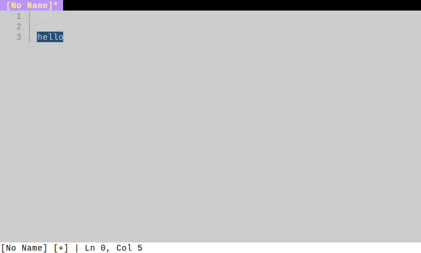

*First word selected*

#### Step 3: two_cursors

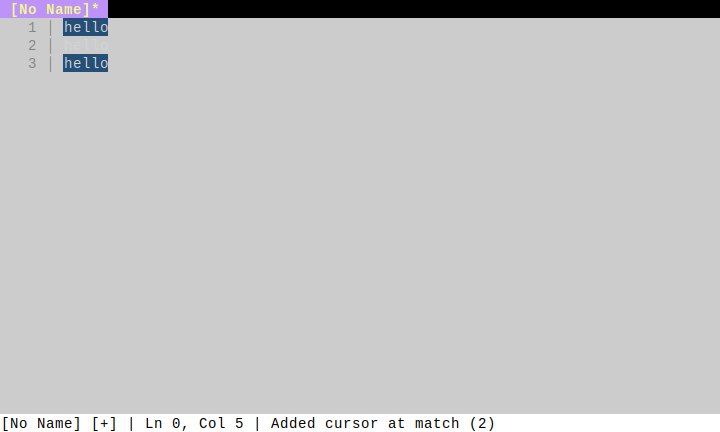

*Second occurrence selected (two cursors)*

#### Step 4: three_cursors

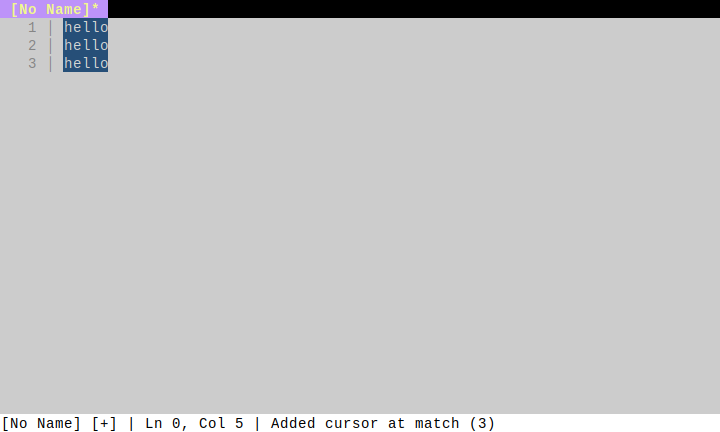

*All occurrences selected (three cursors)*

---

## Appearance

### Theme Colors

*Editor color scheme and syntax highlighting*

#### Step 1: syntax_highlighting

*Syntax highlighting for Rust code*

---

## Core Features

### Help System

*Viewing keybindings and help information*

#### Step 1: initial

*Editor before opening help*

#### Step 2: help_open

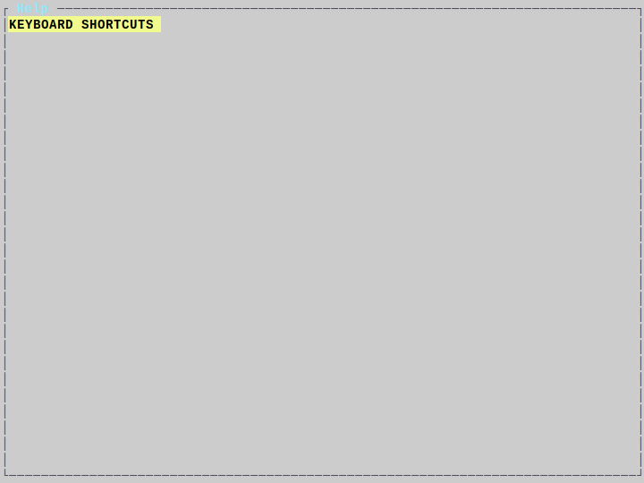

*Help panel showing all keybindings*

---

### Basic Editing

*Basic text editing operations in the editor*

#### Step 1: initial

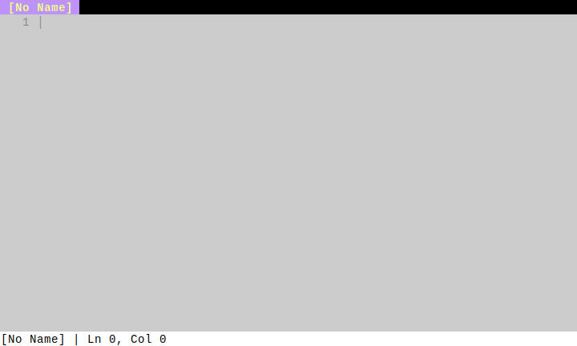

*Empty editor on startup*

#### Step 2: typed_text

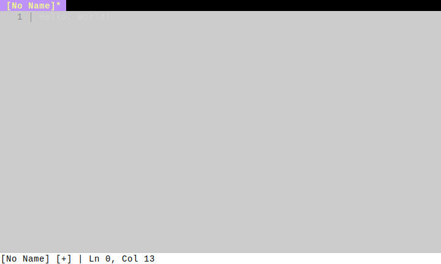

*Text typed into buffer*

#### Step 3: multiline

*Multiple lines of text*

---

### Command Palette

*Using the command palette to execute commands*

#### Step 1: initial

*Editor before opening command palette*

#### Step 2: palette_open

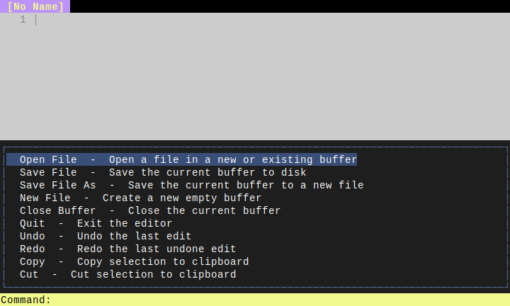

*Command palette opened*

#### Step 3: filtered

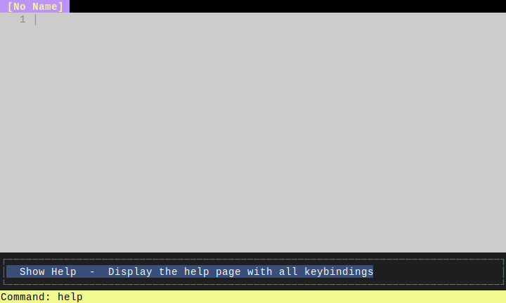

*Commands filtered by search term*

---

## File Management

### File Explorer

*Opening and navigating the file explorer*

#### Step 1: initial

*Editor before opening file explorer*

#### Step 2: explorer_open

*File explorer opened in left pane*

#### Step 3: file_selected

*File selected in explorer*

#### Step 4: dir_expanded

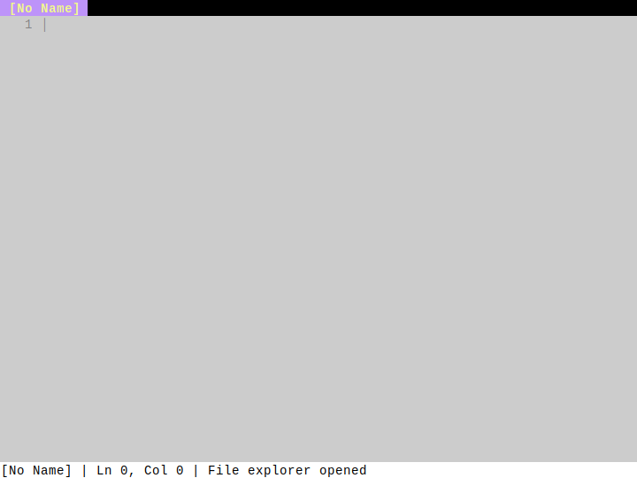

*Directory expanded to show contents*

---

## Layout

### Split View

*Working with split panes*

#### Step 1: single_file

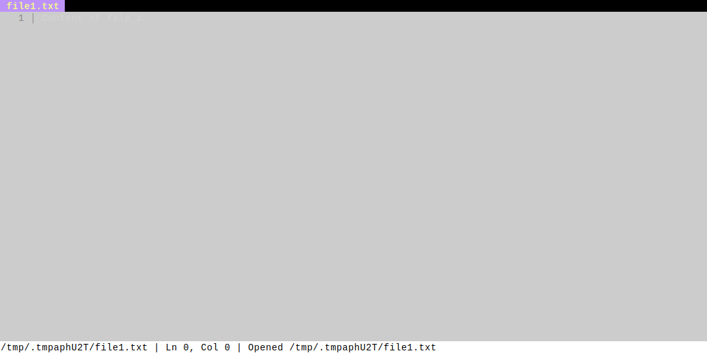

*Single file open*

#### Step 2: horizontal_split

*Editor split horizontally*

#### Step 3: two_files

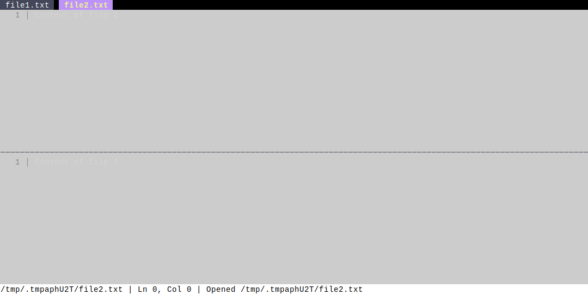

*Two files visible in split panes*

---

